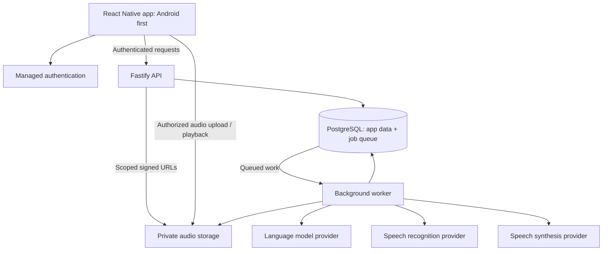

> Historical design/research record. Read [the current handoff](agent-handoff.md) and [product brief](../PRODUCT.md) for implemented scope and naming. These proposals/comparisons do not establish customer demand.

# Historical architecture proposal — superseded

> This earlier proposal contains a larger 17-table Node/Supabase design. It is retained as discussion history only. The implemented lean architecture is in [architecture-lean-candidate.md](architecture-lean-candidate.md).

Date: 2026-10-03. Architecture proposal ready to guide implementation; no application has been built or deployment provisioned.

Status update: the founder requested a leaner v1 and is evaluating FastAPI/Google ADK/PostgreSQL vector memory. Technical preferences are not decisions. This earlier detailed baseline is not mandatory scope; see [lean architecture candidate](architecture-lean-candidate.md) for the revised alternative and reduced data model.

## Product decisions carried forward

- An original relatable saarthi for religiously inclined Hindu adults aged 25–40.
- Understand first, then challenge directly. Help people reach their own conclusions; avoid generic reassurance, insults, and unsupported certainty.
- React Native for Android and iOS; Android launch priority.
- Text chat, recorded voice notes, and optional spoken replies in Hindi, English, and natural Hinglish.
- Separate conversations with shared, optional personal memory.
- Memory covers useful context, preferences, ongoing concerns, chosen actions/outcomes, and tentative patterns people can confirm or reject.
- V1 relies on model knowledge for Gita-inspired reflection. Curated scripture, verified citations, multiple source traditions, detailed character backstory, and live calls are deferred.

## Implementation defaults

These are engineering defaults, not additional founder approvals or proven vendor choices.

| Layer | Default | Reason |
| --- | --- | --- |
| Mobile | React Native + Expo + TypeScript; Expo Router and expo-audio | Shared Android/iOS code with native recording and playback |
| Backend | Node.js + TypeScript + Fastify | Small modular API with shared language and contracts |
| Background work | One Node.js worker process using pg-boss | Durable tasks and retries using the existing database |
| Database | Managed PostgreSQL, initially through Supabase | Conversation, memory, job, and usage records in one system |
| Authentication | Supabase Auth; initially email OTP; Resend via custom SMTP | Auth creates/verifies codes; the email provider delivers them |
| Audio storage | Private Supabase Storage buckets | Short-lived upload/download access; audio kept outside database rows |
| AI integrations | Vercel AI SDK for controlled chat/tool/structured-output calls; server-side speech adapters | Swap providers without changing the domain model |
| Database access | Drizzle ORM + node-postgres; reviewed SQL migrations | Typed queries with explicit PostgreSQL transactions |
| Deployment | API and worker as separate long-running containers; managed data services | Scale HTTP traffic and background tasks independently |
| Packaging | pnpm workspace | One repo for mobile, backend, shared domain, and contracts |

Select compatible stable package versions at scaffolding time. Do not select a model by reputation alone: benchmark conversational quality, Hindi/Hinglish speech, latency, and cost on representative cases. Provider credentials, commercial terms, hosting accounts, prices, and region availability remain build-time decisions. No purchases or external account creation are implied.

## System shape



One backend codebase with logical modules, deployed as an API process and worker process. Modules call shared domain functions; they do not make HTTP calls to one another. No microservices, Redis, graph database, multi-agent framework, or scripture vector pipeline in v1.

## Module responsibilities

| Module | Owns | Boundary |
| --- | --- | --- |
| Identity | User profile, authentication checks, language and memory preferences | Derive user identity from verified tokens, never a submitted user ID |
| Conversations | Conversations, messages, turn order, generation status, cancellation | One active generation per conversation; independent histories |
| Guidance | Context assembly, saarthi behavior, response generation, output checks | Uses a bounded context, not the entire life history on every turn |
| Memory | Extraction, evidence, selection, proposed patterns, correction, forgetting | User-scoped; facts and hypotheses remain distinct |
| Voice | Uploads, transcription, editable transcript, synthesis, playback assets | Voice becomes text before entering the common guidance flow |
| Usage | Quotas, provider usage, cost estimates, future entitlements | Enforce limits before expensive calls; do not count retries as extra user messages |
| Privacy | Consent, memory pause, conversation/account deletion, retention | Stops deleted information being retrieved or recreated by stale jobs |

Sensitive-situation handling lives within guidance: input routing and output checks apply to every modality. It is not an optional app-screen feature. Default behavior: supportive responses, no diagnosis or treatment instructions, and appropriate human-support guidance for serious distress. Location-specific resource data must be verified before release.

## Text message lifecycle

1. App sends `conversation_id`, text, and a generated `client_message_id`.
2. API verifies ownership, request limits, and conversation availability. In a database transaction, create the user message, a generation record, and queued work. Return the existing result for a repeated client ID.
3. App shows a pending turn and polls its status while foregrounded. Fetch persisted state when reopening or reconnecting. Polling stops on completion, failure, cancellation, or backgrounding. Server events can replace polling later without changing the turn model.
4. Worker claims the generation, verifies it is still valid, and loads recent messages, a versioned conversation summary, relevant memories, and active concerns.
5. Guidance chooses an adaptive response approach: listen, clarify, reflect, challenge, or help choose an action. These are internal hints, not a compulsory sequence or visible questionnaire.
6. Generate the response using the fixed persona and language preference. User messages and extracted memories are context, not authority to override system instructions. Do not store hidden model reasoning.
7. Buffer and check the complete response before publishing it. V1 prioritizes a coherent checked reply over token-by-token display; show progress while waiting. If checks reject it, regenerate within a bounded retry budget or return a safe failure response.
8. Commit the completed assistant message and generation status together, and enqueue memory processing in the same transaction. The app sees the durable result.
9. If spoken output is requested, synthesize the committed assistant text asynchronously. Text remains available if synthesis fails. Never generate a separate spoken answer with different advice.

Retries can repeat external API calls and incur provider costs even when our database commits once. Use provider idempotency where available, bounded retries, and usage tracking; do not claim globally exactly-once execution.

## Voice note lifecycle

1. App requests a scoped upload URL, records audio, and uploads it to a private object path allocated by the backend.
2. API validates the uploaded asset's ownership, type, size, and duration. Worker transcribes it with the selected speech provider.
3. Show the editable transcript before the person sends it as a conversation message. This matters for names, code switching, and emotionally important wording.
4. The confirmed transcript follows the same text-message lifecycle. Store its voice provenance; do not maintain a separate voice conversation engine.
5. Raw input audio is temporary by default: delete after successful transcription processing, with a proposed 24-hour maximum TTL for abandoned or failed uploads. Provider retention and deletion behavior must be checked separately.
6. Spoken replies are generated on demand, privately stored for a bounded period, and delivered through expiring URLs. Cache them for replay while retained; support regeneration after expiration.

Recording permission denial, failed upload, silence, failed transcription, and failed synthesis each need a recoverable UI state. Text remains usable throughout.

## Personal memory design

Memory is structured data with evidence, not an ever-growing prompt or an unqualified psychological profile.

- Extract candidates from user-authored messages, not the assistant's speculation.
- Store each item's type, content, status, supporting messages, timestamps, and revision. A report about another person stays a user-reported claim.
- Proposed patterns need more than one distinct supporting situation and explicit confirmation before becoming confirmed memories. Repeating a sentence is not independent evidence.
- An unconfirmed pattern may be raised as a question when appropriate; it must not be treated as an established fact or repeatedly imposed after rejection.
- For ordinary facts and preferences, use structured extraction and validation. Important ambiguity goes back to the person for clarification.
- Memory retrieval starts with SQL filters and bounded relevance selection across active concerns, preferences, recency, and full-text matching. Hindi/Hinglish retrieval quality is not assumed; evaluate it. Add per-user semantic search only if observed misses justify it.
- Keep recent turns and rolling conversation summaries separate from long-term memory. Summaries are versioned compression aids, never independent evidence for a pattern.
- Keep account-level memory consent and a per-conversation private mode. In private mode, neither read nor write shared memory. Explain separately whether conversation history is retained; private mode is not a promise of zero storage.
- On correction or forgetting, invalidate affected summaries and derived retrieval records. Preserve a minimal suppression marker without the forgotten content where needed to prevent re-extraction from retained history.
- A user privacy revision and conversation/source revisions travel with jobs. Recheck them before committing extraction or regeneration. Serialize privacy changes with derived-data commits so deletion cannot race with a late worker write.

## Database outline

| Table | Important fields / purpose |
| --- | --- |
| users | Auth subject, preferred language, memory consent, privacy revision |
| conversations | User owner, title, private-mode flag, status, timestamps |
| messages | Owner, conversation, role, text, source type, client ID, sequence |
| generations | Input message, state, model/prompt version, error, timestamps, revision snapshot |
| conversation_summaries | Conversation, covered message range, source revision, version, summary |
| memory_items | Owner, kind, content, proposed/confirmed/rejected status, revision, timestamps |
| memory_evidence | Memory item and supporting user-message links |
| memory_suppressions | Minimal evidence/source markers preventing unwanted re-extraction |
| concerns | Owner, description, active/resolved status, linked memories |
| commitments | Owner, concern, chosen action, follow-up preference, reported outcome |
| audio_assets | Owner, message/upload link, object key, purpose, state, expiry |
| voice_transcriptions | Owner, input asset, original transcript, state, detected language, expiry |
| consents | Owner, consent category, policy version, acceptance/revocation timestamps |
| usage_reservations | Owner, operation, reserved budget, state, expiry; prevents concurrent overspending |
| usage_events | Owner, generation/job, provider/model, tokens or audio seconds, estimated cost |
| feedback | Owner, assistant message, rating/category, optional comment |
| deletion_jobs | Owner, target scope, progress, failure/retry state |

pg-boss owns its queue schema. Future billing adds subscriptions, entitlements, and verified provider event records when the commercial offer is ready.

Use relational foreign keys, ownership-consistent joins, and unique constraints on `(user_id, client_message_id)` and generation output identity. Add a partial unique constraint or equivalent durable lock for active generation per conversation. Index conversation message pagination, user-owned active memory, audio expiry, and pending generation lookup.

Persist request idempotency and task state in PostgreSQL, not process memory. Deleted conversations invalidate their evidence; delete or rebuild memories derived solely from them, and rebuild affected summaries. Account deletion removes history, derived memory, storage objects, and outstanding work. Clearly distinguish immediate application removal from managed-backup expiry and any provider retention.

## API boundary

Initial resource groups:

- `GET/PATCH /v1/me`: preferences and profile.
- `GET/POST /v1/conversations`; `GET/DELETE /v1/conversations/:id`.
- `GET/POST /v1/conversations/:id/messages`: paginated history and idempotent send.
- `GET /v1/generations/:id`; `POST /v1/generations/:id/cancel`.
- `POST /v1/voice/uploads`; `POST /v1/voice/uploads/:id/transcribe`; status lookup.
- `POST /v1/messages/:id/speech`; audio status and scoped playback URL.
- `GET/PATCH/DELETE /v1/memories/:id` plus memory list and pattern confirmation/rejection.
- `GET/PATCH /v1/concerns/:id` and commitment outcome updates.
- `POST /v1/feedback`; `GET /v1/usage`; account deletion and deletion-status lookup.

The mobile app accesses application data through the API. Auth and narrowly scoped signed audio transfers are exceptions. Privileged database/storage keys and model credentials stay server-side. Validate JWT issuer, audience, expiry, and signature. Backend ownership checks remain mandatory even if database row-level policies are also configured; privileged connections can bypass those policies.

## Repo layout

```text
apps/
  mobile/                 Expo screens, chat, recording, playback, memory UI
  api/                    Fastify routes, auth, request validation
  worker/                 Turn generation, transcription, synthesis, memory jobs
packages/
  domain/                 Conversations, guidance, memory, voice, privacy, usage
  contracts/              Shared request/response schemas and types
  db/                     SQL migrations, queries, transaction helpers
  providers/              Chat, transcription, synthesis, auth/storage adapters
  prompts/                Versioned persona, guidance, extraction, output rules
  evals/                  Synthetic quality cases and regression runner
docs/
  product-discovery.md
  marketing-and-product-angles.md
  architecture-v1.md
```

Keep provider SDKs out of UI components and domain rules. Share contracts rather than importing backend implementation into the app.

## Deployment, operations, and cost

- Development: local PostgreSQL and fake AI/audio providers; configure managed auth/storage in a development project when available. Use separate development and production credentials.
- Production: one API container and one worker container, with managed PostgreSQL/auth/storage. Co-locate app and data regions where possible; verify provider processing locations and retention rather than assuming end-to-end residency.
- Migrations run as a controlled deployment step. Cap database pools and worker concurrency to fit managed connection limits; use a queue-compatible connection mode.
- Collect job/turn IDs, model/prompt versions, latency, tokens, audio seconds, failures, and estimated costs. Default logs omit message text, transcripts, memory content, audio, and signed URLs.
- Set configurable per-user and global token/audio budgets, upload limits, queue limits, and provider timeouts. Reserve quota before a paid call and reconcile actual use afterward. A development/pilot entitlement works before payment integration exists.
- Prefer summaries and bounded memory over resending every historical message. Generate voice only when requested or enabled; avoid paying for unwanted audio.
- Pricing, paid plans, hosting budget, and initial traffic assumptions are still open. No reliable cost forecast can be given before provider benchmarks and expected usage are known.

## Evolution paths

| Later capability | Addition | Existing pieces reused |
| --- | --- | --- |
| Live voice | Real-time media gateway, streaming audio, interruption/cancellation, session state | Identity, context selection, guidance policy, memory, usage |
| Curated scripture | Ingestion, licensed editions, reviewed passages, retrieval, citation verification | Optional guidance context interface and output policy |
| Character backstory | Versioned biography, curated events, constrained stories, exposure history | Persona configuration and conversations |
| Semantic personal memory | Per-user embeddings and hybrid retrieval if needed | Memory evidence, consent, ownership, correction/deletion |
| Payments | Store-appropriate billing adapter, webhook verification, entitlement reconciliation | Usage limits and account identity |

Live voice will still require new transport and latency work; interfaces reduce duplication but do not make it a simple toggle.

## Build sequence and verification

1. Scaffold workspace, local database, auth boundary, and mobile navigation. Verify token rejection and account isolation.
2. Complete one text conversation end to end with durable turn status and a fake provider, then a real provider adapter. Verify duplicate sends, reconnect, cancellation, and retry behavior.
3. Add optional memory with evidence and its review/edit/delete screen. Verify cross-conversation recall, rejected patterns, private mode, and deletion during an in-flight extraction job.
4. Add voice upload, transcript confirmation, and speech playback. Verify on a physical Android device, including microphone denial, interrupted upload, code switching, and provider failure.
5. Run a small synthetic guidance evaluation in Hindi, English, and Hinglish: useful questioning, grounded challenge, willingness to revise, no fabricated exact citations, and sensitive-situation handling. This evaluates product behavior, not clinical effectiveness.
6. Add quotas, cost telemetry, deletion workflows, deploy a pilot, and verify restoration/recovery procedures. Gather repeat-use and payment evidence before expanding scope.

## Documentation checked

- [Expo audio: recording and playback](https://docs.expo.dev/versions/latest/sdk/audio/)
- [Expo runtime and fetch](https://docs.expo.dev/versions/latest/sdk/expo/)
- [Fastify encapsulation](https://github.com/fastify/fastify/blob/main/docs/Reference/Encapsulation.md)
- [pg-boss: PostgreSQL queue, retries, transaction integration](https://github.com/timgit/pg-boss)
- [Supabase Auth](https://supabase.com/docs/guides/auth)
- [Supabase Storage access control](https://supabase.com/docs/guides/storage/security/access-control)

These establish framework capabilities, not proof that this unimplemented product works. Provider quality, deployment behavior, and the stated verification checks remain to be tested during implementation.

## Detailed layer map

1. Presentation: React Native screens and components render conversations, record/play audio, and expose memory controls.
2. Client coordination: shared API client, TanStack Query, session storage, pending-message IDs, network/app-focus handling. Transient UI state uses React state; do not add a second global state system without a need.
3. HTTP boundary: Fastify routes verify authentication, ownership, request schemas, quotas, and idempotency. They create durable tasks and return resource IDs/status.
4. Domain: shared business functions own conversation order, context selection, guidance policy, memory state, privacy, and usage rules. This is where product behavior lives.
5. Execution: worker dispatches queued generation, transcription, synthesis, summarization, extraction, and deletion tasks. Domain logic can be called from both API and worker.
6. Persistence and integrations: Drizzle/PostgreSQL repositories, private audio storage, AI SDK provider adapter, transcription/synthesis adapters, and managed identity.

A layer is an organization of code; a service is a running process or external system. We run two backend processes, not one service per layer. The worker may scale to multiple instances while still being the same logical worker service.

## Authentication and email delivery

Recommended default is Supabase Auth plus Resend SMTP. No accounts, DNS records, or email settings have been provisioned.

1. Mobile app calls `supabase.auth.signInWithOtp({ email })` with a public/publishable project key.
2. Supabase creates the one-time code and sends the configured email through Resend SMTP.
3. Person enters the code; app calls `verifyOtp({ email, token, type: 'email' })`.
4. Supabase returns access and refresh tokens. The SDK manages refresh; a tested secure-storage adapter persists the session on-device.
5. App calls our API with the access token. API verifies the configured JWT signature, issuer, audience and expiry, then looks up the UUID in app users. It checks account state as well as token validity.
6. First authenticated bootstrap idempotently creates the app profile. Onboarding captures language and memory preferences before chat.

Use the `{{ .Token }}` variable in the authentication email template: `signInWithOtp` otherwise sends a magic link by default. Configure expiration and resend limits. Supabase's built-in email delivery is restricted and unsuitable for public production; Resend needs a verified sending domain and production SMTP configuration. Supabase handles code verification, sessions, refresh tokens, and auth rate limits; Resend handles delivery. Email OTP proves control of an inbox, not a person's age or real-world identity.

Our app does not create OTP, password, or refresh-token tables. Supabase maintains its auth schema. The public app key is not a privileged backend key. SMTP credentials, database credentials, privileged Supabase keys, and model credentials never enter the mobile bundle.

Session storage needs real-device tests for token size, refresh, logout and reinstall behavior; SecureStore is not a substitute for handling the entire session lifecycle. Clear query caches on logout/account switch. Recheck account deletion/revocation state for sensitive operations rather than assuming a signed access token implies the account is still active.

## AI framework, roles, and tools

Use Vercel AI SDK (`ai`) for provider calls, typed tools, and schema-based outputs. The SDK runs inside our Node worker; it does not require hosting on Vercel. The exact compatible stable version and provider adapter are selected at scaffolding/evaluation time.

The orchestrator is an ordinary TypeScript function, not an autonomous network of agents:

`runGuidanceTurn → checkRequestContext → loadBoundedContext → generateWithOptionalReadTools → validateResponse → persistResponse → enqueueDerivedWork`

There are three logical model jobs, not three chat personas:

- Guidance: the only user-facing saarthi. Receives persona, language, current conversation, relevant personal context and applicable response rules. Produces a reply; optional structured metadata is internal, not hidden chain-of-thought.
- Memory extraction: a separate asynchronous schema-constrained call over selected user messages; proposes memory/concern/action updates with evidence. Backend validates and applies them.
- Summarization: occasional schema-constrained compression of older turns after a size threshold. It does not independently establish facts or patterns.

Read tools available to guidance when prefetched context is insufficient:

| Tool | Input | Output | Enforcement |
| --- | --- | --- | --- |
| get_memory_details | IDs of visible candidate memories | Details plus source excerpts and confirmation state | Only current user's accessible records; bounded count/content |
| get_concern_history | Concern ID | Relevant prior situations, status, linked evidence | Same user and non-private eligible sources only |
| get_commitment_history | Concern ID | User-chosen actions and reported outcomes | Same user; read-only; bounded history |

User identity and consent are injected into the executor, never accepted as model-selected tool arguments. Private-mode turns expose none of these shared-memory tools. Recheck current permissions and revisions on every tool execution.

Prefetch supplies normal context so ordinary turns need no tool calls. If tools are used, allow a small bounded number of read rounds and a final-response step within a total time/token budget. The stop condition must account for the final output step in the installed SDK. Disable tools on a final fallback call if the model exhausts the budget without producing an answer.

Backend commands such as confirmMemory, rejectPattern, forgetMemory, deleteConversation, and recordChosenAction are not autonomous model tools. User controls trigger explicit commands. Extractors only propose writes, which must cite user-authored evidence. No generic SQL executor, web search, email sender, purchase tool, arbitrary code runner, diagnosis tool, or scripture-search tool in v1. Any future tool needs its own narrow authorization and data contract.

## Package inventory

The following is a proposed dependency inventory, not packages already installed. Add one provider adapter after choosing the model, not every vendor SDK.

| Area | Packages | Role |
| --- | --- | --- |
| Mobile runtime | react, react-native, expo | UI and native app runtime |
| Navigation | expo-router | Login, onboarding, conversation list, chat, memory, settings routes |
| Audio/files | expo-audio, expo-file-system | Record, play, upload preparation and temporary-file cleanup |
| Session storage | expo-secure-store | Secure-storage-backed session adapter |
| Server state | @tanstack/react-query | API caching, mutations, foreground status polling |
| Connectivity | expo-network | Reconnect handling integrated with Query online state |
| Localization | expo-localization, i18next, react-i18next | Device locale and app-interface translations; distinct from LLM reply language |
| Managed services client | @supabase/supabase-js | Auth on mobile; authorized storage/admin operations on backend |
| API | fastify, @fastify/helmet, @fastify/rate-limit | Routes, HTTP headers, request throttling; distributed quota remains in PostgreSQL |
| Token verification | jose | JWT verification using configured signing keys/JWKS |
| Schemas | zod | Shared API/model-output/tool schemas; explicitly connect validation to route handlers |
| Database | pg, drizzle-orm | PostgreSQL connections, typed repositories and transactions |
| Migrations | drizzle-kit | Generate reviewed SQL migrations and run controlled migration steps |
| Durable work | pg-boss | Queue dispatch, retries and scheduled maintenance |
| AI calls | ai plus one compatible provider adapter | Model calls, read tools and structured outputs |
| Logging | Fastify's Pino integration | Redacted structured API logs; worker uses Pino with the same policy |
| Development | typescript, tsx, appropriate @types packages | Type checking and local execution |
| Tests | vitest, @testing-library/react-native | Domain/integration verification and important UI-state tests |

Resend SMTP is configured in Supabase; our API does not need the Resend SDK for login. Use native fetch for ordinary HTTP calls rather than adding Axios by default. Provider-specific transcription/synthesis SDKs are selected only after speech benchmarks. UI styling/components can be chosen while building; they do not determine backend architecture.

## Table-level specification

This is a logical schema for implementation, not SQL already migrated. Use UUID primary keys, UTC timestamps, and owner checks. Mutable records have `created_at`/`updated_at` as needed; append-only records have creation time. Foreign keys carrying user data must enforce consistent ownership. The fields below are minimum useful columns, not a promise of a permanently frozen schema.

### Managed tables

- `auth.users`: managed identity; UUID, email, auth metadata. Our app's `users.id` references this identity. Supabase also owns session/identity/token implementation tables; app code does not write them directly.
- Managed storage metadata: Supabase's bucket/object tables; app code uses storage APIs rather than hand-editing metadata. Actual audio bytes live in object storage.
- pg-boss queue tables: managed by pg-boss in its own schema. Jobs carry entity IDs and revision snapshots, not whole transcripts or memory documents.

### Application tables — 17

| Table | Minimum useful fields | Why it exists |
| --- | --- | --- |
| users | id/auth UUID, display_name, preferred_language, memory_enabled, privacy_revision, account_state, timestamps | App preferences and account state, separate from authentication internals |
| conversations | id, user_id, title, memory_mode, status, source_revision, timestamps | Separate discussions and per-conversation privacy |
| messages | id, user_id, conversation_id, sequence, role, content, source_type, client_message_id, generation_id nullable, created_at | Durable actual dialogue; confirmed voice transcript is message content |
| generations | id, user_id, conversation_id, input_message_id, state, model_id, prompt_version, privacy/source revision snapshot, attempt_count, error_code, started_at, completed_at | Tracks pending/running/completed/failed/cancelled reply generation |
| conversation_summaries | id, user_id, conversation_id, through_sequence, source_revision, version, content, created_at | Bounded prompt context without resending all old turns |
| memory_items | id, user_id, concern_id nullable, kind, content, status, revision, last_confirmed_at, timestamps | Durable facts/preferences and explicitly tentative patterns |
| memory_evidence | id, user_id, memory_item_id, message_id, evidence_kind, created_at | Connects a memory to the user's actual words |
| memory_suppressions | id, user_id, source_message_id, suppressed_kind, suppression_key, created_at | Prevents extraction from recreating a forgotten item; omit forgotten prose |
| concerns | id, user_id, source_message_id, title, description, status, timestamps | Ongoing situations spanning conversations |
| commitments | id, user_id, concern_id nullable, source_message_id, action_text, status, follow_up_enabled, reported_outcome, outcome_message_id nullable, timestamps | Actions the user chose and what they report happened |
| audio_assets | id, user_id, conversation_id nullable, message_id nullable, kind, storage_key, state, mime_type, bytes, duration_ms, expires_at, timestamps | Input audio and synthesized replies, with ownership and retention |
| voice_transcriptions | id, user_id, audio_asset_id, state, original_text nullable, detected_language nullable, error_code nullable, expires_at, timestamps | Temporary editable transcript before it becomes a sent message |
| consents | id, user_id, category, policy_version, accepted_at, revoked_at nullable | Records memory and other relevant consent decisions |
| usage_reservations | id, user_id, operation_id, budget_kind, reserved_units, state, expires_at, timestamps | Atomically reserves capacity so concurrent jobs cannot overspend quota |
| usage_events | id, user_id, operation_id, provider, model_id, operation_kind, input_tokens, output_tokens, audio_seconds, estimated_cost, currency, created_at | Actual consumption, including retries; do not store conversation prose |
| feedback | id, user_id, assistant_message_id, category, rating nullable, comment nullable, created_at | Product feedback tied to a specific reply |
| deletion_jobs | id, user_id, scope, target_id nullable, state, checkpoint, error_code nullable, timestamps | Retryable cleanup of source and derived data plus audio |

Useful enums: messages role = user/assistant; source = typed/voice. Generation state = queued/running/completed/failed/cancelled. Memory kind = fact/preference/pattern; status = proposed/confirmed/rejected. Concern status = active/resolved/archived. Reservation state = reserved/settled/released. These are explicit state models, not free-form strings interpreted differently in each layer.

`memory_suppressions` is not magic: its extraction keys must remain stable across retries and prompt versions, and suppression rules must be tested against retained history and summaries. For broad forgetting, invalidate the relevant source eligibility instead of keeping an encoded copy of the forgotten content. Raw/provisional transcription text expires independently of the final user-confirmed message.

The principal relationships are:

```text
auth.users → users → conversations → messages → generations
                  → memory_items → memory_evidence → messages
                  → concerns → commitments
                  → audio_assets → voice_transcriptions
                  → consents / usage_reservations / usage_events / feedback / deletion_jobs
conversations → conversation_summaries
```

Arrows express ownership or links, not insert order. Specifically, generations reference an input message, while assistant output messages optionally reference the generation. Allocate a generation ID before inserting an assistant output; enforce one committed output per generation. Composite ownership keys or equivalent database constraints prevent linking a memory owned by one user to another user's message.

Payments later add subscriptions, entitlements and billing_events. Curated scripture later adds source_editions, passages/commentaries and response_citations. Character and embedding tables are deferred until those features are needed.

## Reference additions

- [AI SDK agents and controlled workflows](https://ai-sdk.dev/docs/agents/overview)
- [AI SDK tool calling](https://ai-sdk.dev/docs/ai-sdk-core/tools-and-tool-calling)
- [AI SDK structured output](https://ai-sdk.dev/docs/ai-sdk-core/generating-structured-data)
- [Supabase email OTP](https://supabase.com/docs/guides/auth/auth-email-passwordless)
- [Supabase custom SMTP](https://supabase.com/docs/guides/auth/auth-smtp)
- [Resend with Supabase SMTP](https://resend.com/docs/send-with-supabase-smtp)
- [TanStack Query with React Native](https://tanstack.com/query/latest/docs/framework/react/react-native)
- [Expo SecureStore](https://docs.expo.dev/versions/latest/sdk/securestore/)
- [Drizzle PostgreSQL integration](https://orm.drizzle.team/docs/get-started-postgresql)
